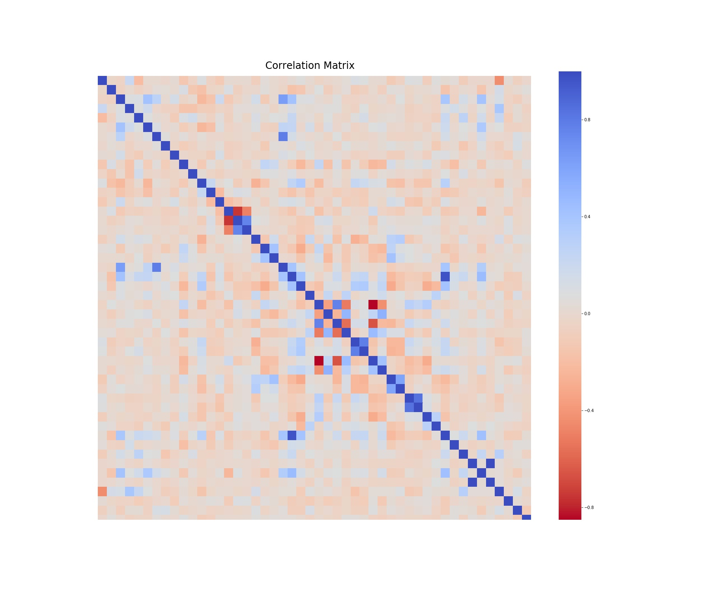
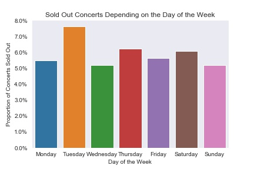
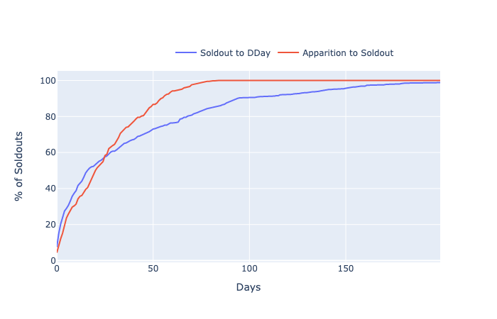
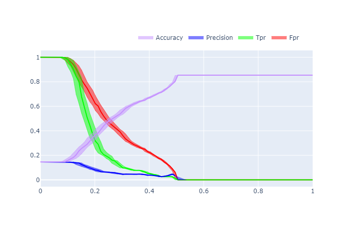

# Concert Ticket Analysis 

## Introduction

Ed Sheeran's last concert sold out within 5 min and was advertised on Viagogo for as high as 800€ soon after (vs 80€ initially). Concert prices can vary wildly depending on the type of event. For some really popular events, primary tickets are almost impossible to get a hold of. Ticket scalping is an industry in and of itself. 

Both big music fans, we aimed at cracking the code of the concert industry and set out to predict what concert would sell out. In front of the diversity of events and artists, we were convinced that data science could prove invaluable in approaching the problem and provide very actionable insights that could have enduring effects on the music industry. 

**Would we be able to predict whether a concert would sell out? If so, could we predict what's its fair value and its final resale price would be?**

Convinced by the potential relevance of our work, we have decided to keep our code private **for now**. However, we outline our approach and our findings in this report as follows:

_**[1. Data Scraping](#scraping)**_

_**[2. Data Processing & Feature Engineering](#processing)**_

_**[3. Finding the Best Model](#model)**_

_**[4. Final Results & Dashboard](#results)**_

## 1. Data Scraping 

Given the nature of our problem, it was impossible to find readily available historical data. Hence, we started creating our own dataset and run our script on a daily basis at 9PM PST. We started scraping the data on *October 19th 2019* and aggregated data from 4 different sources using the available **APIs** and the **Python Requests Library** for web scraping:
1. [SongKick](http://songkick.com)
   - Gave us the calendar of upcoming events and details on the events' venues
   - Allowed us to check if the event was sold out
2. [Spotify](http://spotify.com)
   - Provided us with information regarding the artists and their genre
   - Allowed us to use songs' characteristics as features
3. [Last.fm](http://last.fm)
   - Giving us additional features on artists' genres and popularity stats
4. [SeatGeek](http://seatgeek.com)
   - Provided with consistent insights into secondary markets (number of listings, price range, etc.)

To alleviate the burden of running a script every day, we created a virtual machine instance on [Google Cloud Platform (GCP)](https://cloud.google.com/) and created a Cron-Job to automate the process. 

We hypothesized that most of the popular events and the demand was centered around the main urban areas and thus decided to focus our research on the four main US metropolitan areas: **New York**, **San Francisco**, **Chicago** and **Los Angeles**.

## 2. Data Processing & Feature Engineering 

### Data Cleaning & Processing

#### Merging the Datasets and matching the strings
Given the variety of sources that we used we faced numerous problems in aggregating our datasets. One of our main problem, besides the diversity in format among the various sources, was in **reconciliating the different concerts and making sure that the string matched appropriately.**

Some artists' names are rather ambiguous (i.e. [The Blaze](https://open.spotify.com/artist/1Dt1UKLtrJIW1xxRBejjos?si=q-pILVELSlCO6iOFa1kiPg) is very very different from [Blaze](https://open.spotify.com/artist/5yK5YSsWKH35QRTsHQHxEN?si=fczjQ-m1Sp62ikfH3gJMFA)) and required the utmost attention as we navigate through the different APIs. If the artist performing at an event is "Blaze", we don't want the data about "The Blaze" for this concert.

Hence, we leveraged [SeatGeek](http://seatgeek.com)'s fantastic library, [Fuzzy Wuzzy](https://github.com/seatgeek/fuzzywuzzy), intensely to make sure that the artists' and the events' names matched exactly acrossed the different sources. 

#### Updating the Records on a Daily Basis

An additional challenge we faced was to aggregate our observations accordingly. Every day, we collected information on **~9,000 events**. As we aggregated our data, we had to be careful at which information we would update from one day to the next and at our memory usage. We used various tricks such as the **Multiprocessing Python Library** to efficiently process the different data types and limit runtime.

#### Leveraging More Details for Matching with [SeatGeek](http://seatgeek.com)

We seeked to collect data regarding the secondary markets and quickly noticed that the task was more difficult than it seemed. Indeed, we needed to find on SeatGeek the same event that we found on SongKick to have an accurate database. As some artists performed twice a day in a given city, parking passes were sold for some events, etc... We thus used stringent criteria so as to guarantee that our datasets would remain as accurate as possible.

### Dealing with High Dimensions

There are countless different venues and music genres/tags represented in our dataset. To incorporate a maximum of informations from these, we attempted various clustering techniques such as [K-Modes](https://pypi.org/project/kmodes/) (an equivalent of K-Means, but for cathegorical data) or using proxy variables such as the number of seats or latitudes/longitudes. Ultimately, we settled on leveraging Multiple Correspondance Analysis ([MCA](https://github.com/MaxHalford/prince)) as it allowed us to reduce significantly the number of dimensions while keeping the unique information embedded in the venue, the genre or the tag itself.

### Exploratory Data Analysis

Armed with our dataset and **40+ features**, we tried to get a grasp of some underlying dynamics.

### Correlation & VIF Analysis

As we tried to understand what were the key drivers of concerts' popularity, we started by looking at how correlated our variables were. 

Aside from songs' internal characteristics and popularity indicators, our variables seem to be relatively uncorrelated and we were able to weed out redundant information from the dataset.

Since pairwise-correlation is insufficient to visualize multicollinearity, we also used VIF analysis to better understand redundancies. 

**We found that ... - VIF conclusions to add**

### Going Beyond our Prejudice

Interestingly, regardless of the urban areas, **~6%** of concerts eventually sell out.

While we may have expected that concerts sell-out primarily around the weekend, our analysis also indicates that sell-out rates are relatively uniform through the week days.

The graphs below highlight the probability distribution of a concert selling out depending on:
1. The time since the concert was announced (**red**)
2. The time remaining before the event (**blue**)
   
Initially, we thought that most of the concerts that sold out did so right after sales were released. However, as it can be seen below, the rate of sell-out seems to follow an exponential distribution.

Interestingly, as highlighted by the graph above, ~50% of concerts sell out within 20 days of being announced and around 16 days before the concert happens.

### Visualizing distributions

**Insert graphs generated a while back visualizing distributions**

## 3. Finding the Best Model 

We aimed at optimizing the ability of our model to correctly predict that a concert would sell out. We created a "sold-out" variable and encoded it 1 if the concert was sold out and 0 if not. As we aimed to accurately predict concerts that would sell out, we focused on maximizing **Precision**, which is defined as:
  

To assess a model performance, we measure and bootstrap its precision for various threshold levels.

### Logistic Regression

We started by using a simple model: Logistic Regression and found the following results:

We highlighted the 95% confidence interval (found using Bootstrap) of the various metrics with colored shadows around the lines. The results were insufficient. The range of probability returned by the logistic regression was not wide enough (the model was never sure of a concert's ability to soldout), leading our model to predict only "not soldout concert" above a threshold of 0.5. Even applying over/undersampling techniques such as SMOTE did not help the results meaningfully. 

To improve our results, we used a Random Forest:

### Random Forest

**ADD RESULTS RF**

## 4. Final Results & Dashboard 

In the end, we settled on using LightGBM. It provided us with numerous advantages including:
- Simplified class imbalance management
- Efficient runtime
- Advanced categorical variable handling
- Ability to model complex nonlinear relationships

### Hyperparameter Tuning

Being a boosting model, LightGBM has plenty of hyperparameters. We used Bayesian optimization techniques to find their optimal values.

Leveraging the [Hyperopt Python Library](https://github.com/hyperopt/hyperopt) and LightGBM built-in cross-validation tool, we assessed the various hyperparameters and settled on the ones that would maximize our Area Under the Curve ([AUC](https://towardsdatascience.com/understanding-auc-roc-curve-68b2303cc9c5)).

### Results

With our tuned LightGBM, we were able to get the following results on *February 2nd, 2020*: 

**Insert Graph**

Below, we highlight a potential confusion matrix that maximizes precision  according to illustrate our results:

|  | Predicted Not Sold-Out | Predicted Sold Out |
|--------------|:----------------------:|-------------------:|
| Not Sold-Out | 1725 | 3 |
| Sold-Out | 173 | 18 |

*Note: As we are constantly getting new data on a daily basis, our model is still improving!*

### Tkinter & Dash

To visualize and simplify interactions with our datasets, we created a dashboard. 

We started building a [Tkinter](https://www.geeksforgeeks.org/python-gui-tkinter/) tool that would allow us to aggregate our data sources, run the model, and visualize concerts very likely to sell out. We added various features such as the number of sold-out concerts an artist currently had planned.

We also developed a portfolio management tool that allowed users to track potential purchases and current resale prices so as to facilitate hypothetical trading.

However, as Tkinter felt a bit heavy on our machines, we decided to create an online dashboard that provided with the same functionalities except that this time would be hosted on a virtual machine using SQL and [Dash](https://plot.ly/dash/) for the frontend part, and [Django](https://www.djangoproject.com/) for the backend part.

## Conclusion

While this project was challenging, we have successfully designed a tool that can predict concert selling out with a precision of more than **85%** (a 17x uplift over the naive baseline model). Going forward, we are trying to implement a more robust model that could predict the *clearing price* of a concert ticket, allowing artists and venues to price tickets so as to maximize revenue and fan engagement.

We are convinced that this project could have important consequences on the music industry as a whole. Beyond revolutionizing the scalping industry, this could become invaluable for artists and concert halls and allow them to price their events much more efficiently. As another example, labels and artists could also use this tool to get a better of sense of performers' popularity and the demand for such events. 

**We are still working on this project so please feel free to contact us if you have any comments or questions!** 

## Sources

- [Ed Sheeran tickets SOLD OUT in under five minutes - *The Independent* (Feb 2017)](https://www.independent.ie/entertainment/ed-sheeran-tickets-sold-out-in-under-five-minutes-35417761.html)